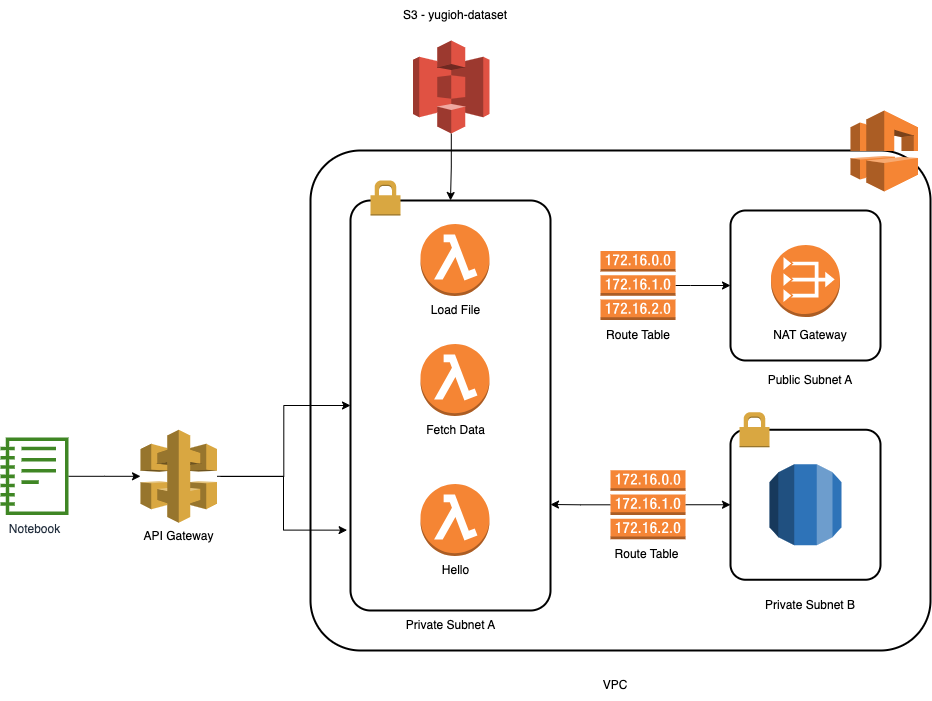

# Ciencia de Datos - Proyecto 2


## Descripción

Análisis de los deck de Yugioh 

## Requerimientos 

- [npm](https://www.npmjs.com/)
- [serverless framework](https://www.serverless.com/)
- [python3](https://www.python.org/downloads/)

## Instalación 

1. Clonar el repositorio  

```
git clone https://github.com/luisramilian95/iio-data-science-project-2
```

2. Instalar las dependencias  

```
npm install 
```

3. Ir a la carpeta serverless

```
cd serverless
```

4. Desplegar las lambdas

```
sls deploy
```

5. Subir los archivos al bucket `yugioh-dataset`

6. Instalar las dependencias 
   1. numpy
   2. pandas
   3. requests
   
7. Correr el archivo `main.ipynb`


## Arquitectura de AWS 




### Integrantes
Oscar Ramírez 23006382\
Luis Ramírez 23008845\
Silvio Urizar 23008607\
\
\
Enlace para video:
